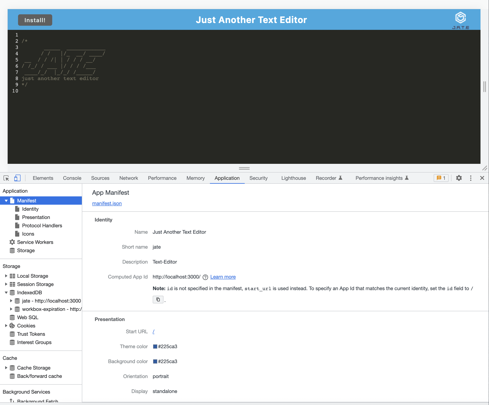
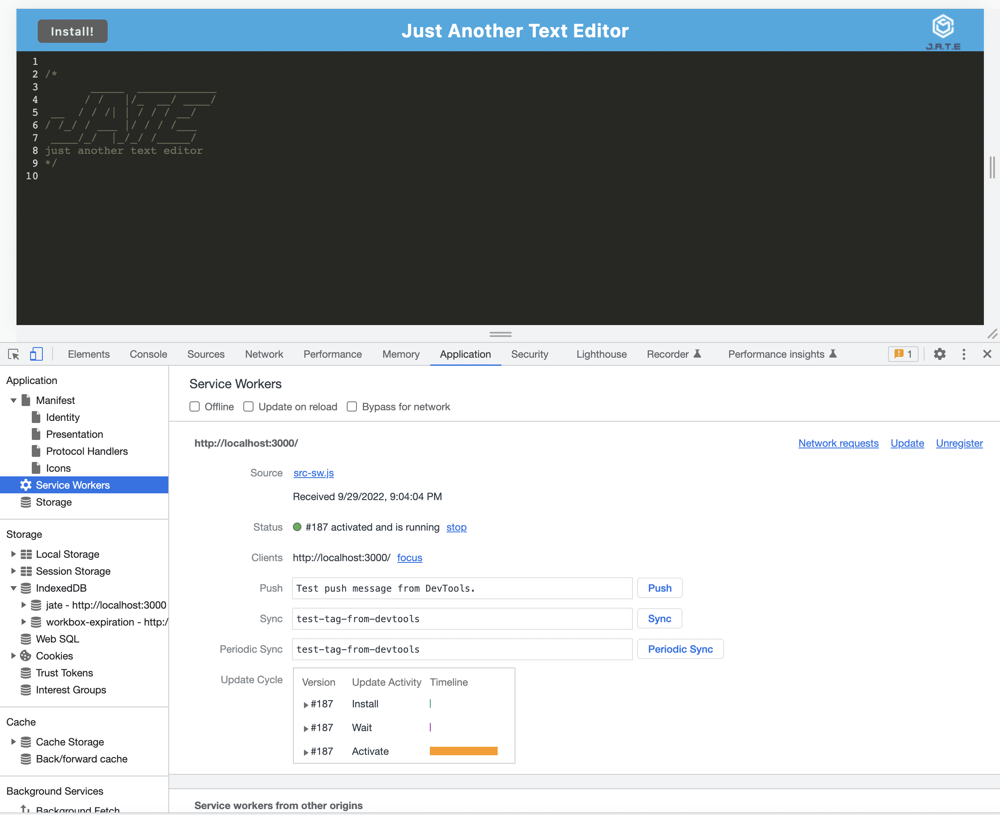

# Text_Editor

## Table of Content
- [Description](#description)
- [Usage Information](#usage)
- [License](#license)
- [Contributor](#contributor)
- [Contact Information](#contact)

## Description

Create notes or code snippets with or without an internet connection with this single page text editor app.  

## Usage

Click on the Heroku app link below  
<a href="https://just-another-text-editor-app.herokuapp.com/" title="Text_Editor" >just-another-text-editor-app.herokuapp.com</a>  
then click install

## License

[ISC](https://choosealicense.com/licenses/isc/) license

## Contributor

Jason South

## Contact
Jason South  
GitHub username: jsouth75  
Email: jason.south@me.com
